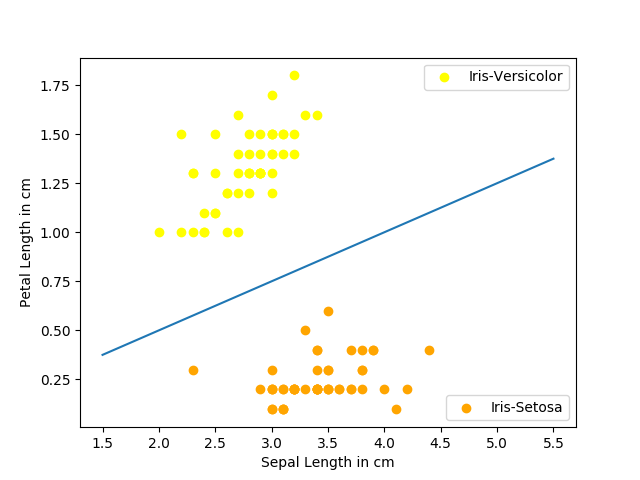
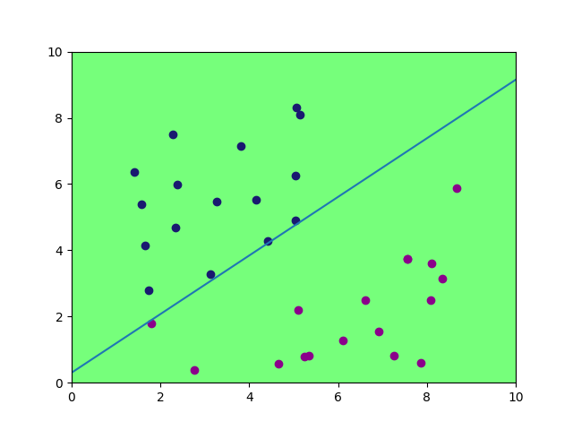
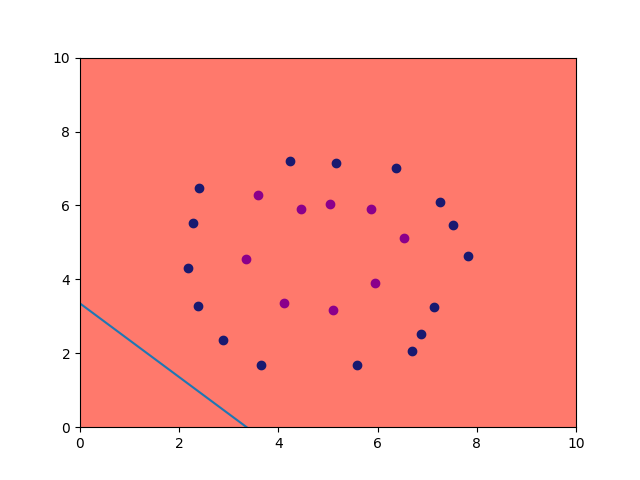

# Machine Learning Algorithms
The repository is a personal project of implementing all of the machine learning algorithms that I learnt from scratch. I do so as to get a better intuitive understanding of the different algorithms, how they work, their complexity and their limits.

So far, the algorithms that were implemented are: Perceptron, Adaline, and currently working on K-NN. 

## Usage of Models

A simple usage example for Perceptron is:
```python
from perceptron import Perceptron

my_model = Perceptron()
my_model.train(X_train, Y_train)
my_model.predict(X_test)
```
A simple usage example for Adaline is:
```python
from adline import Adaline

my_model = Adaline()
my_model.train(X_train, Y_train)
my_model.predict(X_test)
```

## Usage of Visualisation

By executing:
```bash
python3 perceptron_show_iris.py
```

One gets this image, showing that the algorithm well on the Iris dataset.





Now one can interactively input points to test Perceptron. To do so, all you need it to:
```bash
python3 perceptron_show_manual.py
```
And then click with the mouse on the plot. THe right mouse click will set the first class points and the left mouse click will set the second class. Once done, click on the "X" button. If the background becomes green then it means that the perceptron managed to separate the data, otherwise it was unsuccesful.






